# RESTful API Gateway for a Social Network Platform - Concept App

## Summary

I built this App because I wanted to learn more about using a NoSQL Database in
collaboration with an Express server running on Node. I used MongoDB as my
Database, and Mongoose as my ODM.

## The Concept

A social network platform with a fully-functional RESTful API gateway. The API
connects to a NoSQL Database that is fast, flexible, and allows for large volumes
of unstructured data.

- All activity within the platform is tied to a unique `User`.
- A `User` can have friends.
  - Can `post` or `delete`.
  - The added friend `User.id` will appear in `User.friends[]` on the `User` adding a friend only.
- A `User` can `post` or `delete` a `Thought`.
  - A `User` specific `Thought.id` will appear within `User.thoughts[]`.
- A `User` can `post` or `delete` a `Reaction` to a `User.Thought`.

---

## Table of Contents

- [RESTful API Gateway for a Social Network Platform - Concept App](#restful-api-gateway-for-a-social-network-platform---concept-app)
  - [Summary](#summary)
  - [The Concept](#the-concept)
  - [Table of Contents](#table-of-contents)
  - [Node Package Dependencies](#node-package-dependencies)
  - [Repo Stats](#repo-stats)
  - [Contact Erik Plachta](#contact-erik-plachta)
  - [Getting Setup](#getting-setup)
- [API Reference](#api-reference)
  - [Route: **`/api/users`**](#route-apiusers)
    - [`POST` - Create a New `User` Entry](#post---create-a-new-user-entry)
    - [`GET` - ALL `User` Entries](#get---all-user-entries)
  - [Route: **`/api/users/:id`**](#route-apiusersid)
    - [`GET` - Single `User` Database Entry By `_id`](#get---single-user-database-entry-by-_id)
    - [`PUT` - Change `User` Value(s) by `_id`](#put---change-user-values-by-_id)
    - [`DELETE` - Remove a `User` from Database](#delete---remove-a-user-from-database)
  - [Route: **`/api/users/:userId/friends/:friendId`**](#route-apiusersuseridfriendsfriendid)
    - [`POST` - Create One-Way Association To a `User` in `User.friends[]`](#post---create-one-way-association-to-a-user-in-userfriends)
    - [`DELETE` - Remove Existing `friends` Association](#delete---remove-existing-friends-association)
  - [Route: **`/api/thoughts/`**](#route-apithoughts)
    - [`POST` - Create a New `Thought` Entry](#post---create-a-new-thought-entry)
    - [`GET` - ALL `Thought` Entries](#get---all-thought-entries)
  - [Route: **`/api/thoughts/:id`**](#route-apithoughtsid)
    - [`GET` - Single `Thought` Entry by `_id`](#get---single-thought-entry-by-_id)
    - [`PUT` - Change `Thought` Value(s) by `_id`](#put---change-thought-values-by-_id)
    - [`DELETE` - Remove a `Thought` Entry by `_id`](#delete---remove-a-thought-entry-by-_id)
  - [Route: **`/api/thoughts/<thought-id-here>/reactions`**](#route-apithoughtsthought-id-herereactions)
    - [`POST` - Create a New `Reaction` Database Entry Associated to a `Thought`](#post---create-a-new-reaction-database-entry-associated-to-a-thought)
  - [Route: **`/api/thoughts/<thought-id-here>/reactions/<reaction-id-here>`**](#route-apithoughtsthought-id-herereactionsreaction-id-here)
    - [`DELETE` - Remove a `Reaction` Entry from a `Thought`](#delete---remove-a-reaction-entry-from-a-thought)
- [Database Structure](#database-structure)
  - [`UserSchema`](#userschema)
  - [`ThoughtSchema`](#thoughtschema)
  - [`ReactionSchema`](#reactionschema)

---

## Node Package Dependencies

<!-- - **Utility**
  - [dotenv](https://www.npmjs.com/package/dotenv) - Used for local enviornment variables. -->
  <!-- - [moment]([#moment](https://www.npmjs.com/package/moment)) - Used by full-stack front helper functions for date-time manipulation. -->
<!-- - **Security**
  - [express-session](https://www.npmjs.com/package/express-session) - Used to allow a secure client sessions via the web browsers cookies/local caching.
  - [connect-session-sequelize](https://www.npmjs.com/package/connect-session-sequelize) - Used to create a session between user and the Database.
  - [bcrypt](https://www.npmjs.com/package/bcrypt) - Used to hash user passwords. -->
- [dotenv](https://www.npmjs.com/package/dotenv) - Used for local environment variables.
- [express](https://www.npmjs.com/package/express) - The controller managing all communication between view and the database.
<!-- - **View**
  - [express-handlebars](https://www.npmjs.com/package/express-handlebars) - The View engine running the users for full-stack app. -->
- [Mongoose](https://www.npmjs.com/package/mongoose) - A DRM for the MongoDB API database.
- [Nodemon](https://www.npmjs.com/package/nodemon) - Using as a dev-dependency to restart Express server with changes to simplify development.
  <!-- - [mysql2](#mysql2) - A DRM for MySQL/JawsDB full-stack frontend User database.
  - [sequelize](https://www.npmjs.com/package/sequelize) - ORM for MySQL/JawsDB full-stack frontend user database. -->

## Repo Stats

[](https://github.com/ErikPlachta/api-gateway-express-mongodb)

[](https://github.com/ErikPlachta/api-gateway-express-mongodb)
[](https://github.com/ErikPlachta/api-gateway-express-mongodb)

[](https://github.com/ErikPlachta/api-gateway-express-mongodb/issues)


## Contact [Erik Plachta](https://github.com/ErikPlachta)

If you want to get in touch talk dev, collaborate, help improve my work, feel
free to reaech out to me on [Twitter](https://www.twitter.com/erikplachta/) or
[LinkedIn](https://www.linkedin.com/in/erikplachta/).

## Getting Setup

<!-- The APP can either be ran Headless as an API Gateway or as a complete Full-Stack. -->

<!-- ### Headless | MongoDB & Express -->

<!-- > It's meant to server as an API-Gateway to an already existing View. -->

<!-- #### Requirements - Getting Set Up for Headless -->

1. [MongoDB](mongodb.com/try/download/community) is fully installed and setup.
  > [See guide here for help](https://coding-boot-camp.github.io/full-stack/mongodb/how-to-install-mongodb).
2. [Node.js](https://nodejs.dev/download) is fully installed and set up.
  > [See guide here for help](https://coding-boot-camp.github.io/full-stack/nodejs/how-to-install-nodejs).
3. [Download the Repo](https://github.com/ErikPlachta/api-gateway-express-mongodb/archive/refs/heads/main.zip).
4. Unzip and Open with your IDE of choice.
5. Install Node Packages with `npm i`.
   > > 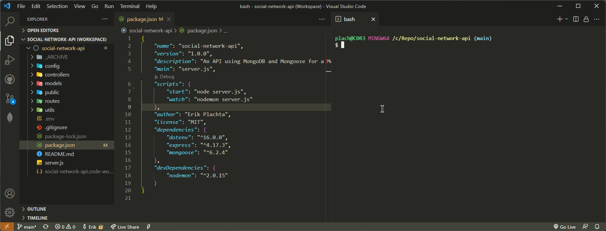  
6. Run with `npm start`.
   > 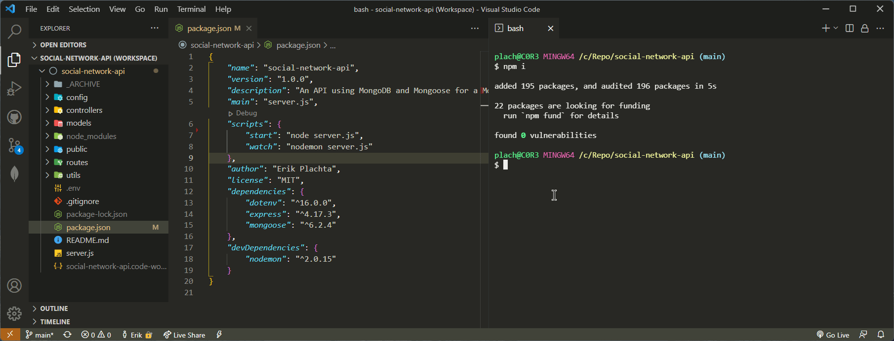 
7. Start making API calls.
    > *This APP is designed to be a headless RESTful API gateway. You'll need to use a tool like [Insomnia](https://insomnia.rest/download) to use it.*

<!-- ### B. Full-Stack | MongoDB, MySQL, Express, Handlebars
  
The headless version of the APP is a complete MVC stack. It includes a Model,
Controller, and View for a complete user experience.

#### Requirements - Getting Setup for Full-Stack

- [MongoDB](mongodb.com/try/download/community) is fully insatlled and setup
  > [See guide here for help](https://coding-boot-camp.github.io/full-stack/mongodb/how-to-install-mongodb)
- [Node.js](https://nodejs.dev/download) is fully instealled and setup
  > [See guide here for help](https://coding-boot-camp.github.io/full-stack/nodejs/how-to-install-nodejs)
- [MySQL](https://dev.mysql.com/downloads/mysql/) is fully insatlled and setup
  > [See guide here for help](https://coding-boot-camp.github.io/full-stack/mysql/mysql-installation-guide)
- [Download the Repo](https://github.com/ErikPlachta/api-gateway-express-mongodb/archive/refs/heads/main.zip)
- Unzip and Open with your IDE of choice
- Install Node Packages with `npm i`
- Update your .env file
  - `RENAME.env` to `.env`
  - Add your MySQL login details
    - Add `DB_USER`
    - Add `DB_PASSWORD`
  - Crate your own `SECRET` -->

---

# API Reference

## Route: **`/api/users`**

### `POST` - Create a New `User` Entry

Make a POST request to create a new `User` with a JSON Body a unique `username`, a unique
`email` and a password that is 6 or more characters.
> [See here for more details on the User Schema](#userschema).


- **Path**
  - `/api/users/`
- **Use**
  - POST  `127.0.0.1:3001/api/users/`
  - JSON Body

    ```json
    {
      "username"  : "<username>",
      "email"     : "<your@email.com>",
      "password"  : "<your-password>"
    }
    ```

- **Example**
  > 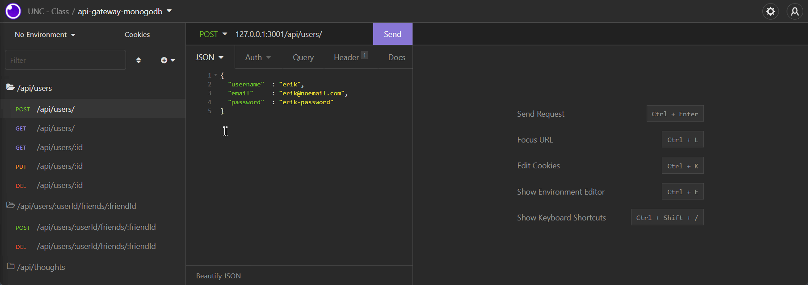

---

### `GET` - ALL `User` Entries

Make a GET request to receive ALL `User` data within the database. The `thoughts[]`
and `friends[]` fields will just return the related Schema object `_id`s.
> [See here for more details on the User Schema](#userschema).

- **Path**
  - `/api/users/`
- **Example**
  > 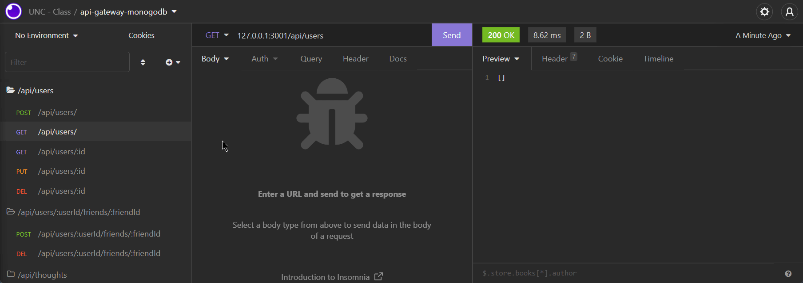
- **Use** 
  - GET `127.0.0.1:3001/api/users`

---

---

## Route: **`/api/users/:id`**

### `GET` - Single `User` Database Entry By `_id`

Make a GET request for a specific `User` by `_id` to get a single `User` with
populated `thoughts[]` and `friends[]` content.

- **Path**
  - `/api/users/:id`
- **Example**
  > 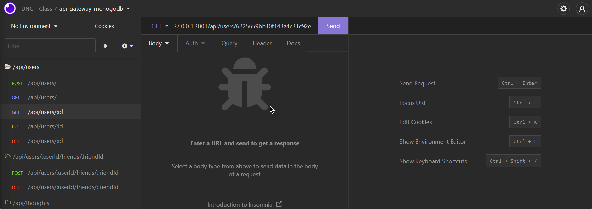
- **Use**
  - GET `127.0.0.1:3001/api/users/<user-id-here>`

---

### `PUT` - Change `User` Value(s) by `_id`

Make a PUT request with the `User._id` as a parameter, and a JSON Body of `User`
fields you'd like to update in alignment with [User](#userschema) field
requirements.

- **Path**
  - `/api/users/`
- **Use**
  - PUT `127.0.0.1:3001/api/users/<user-id-here>`

    ```json
      {
      "username"  : "<new-unique-username>",
      "email"     : "<new-unique@email.com>",
      "password"  : "<new-password>"
      }
    ```

- **Example**
  > 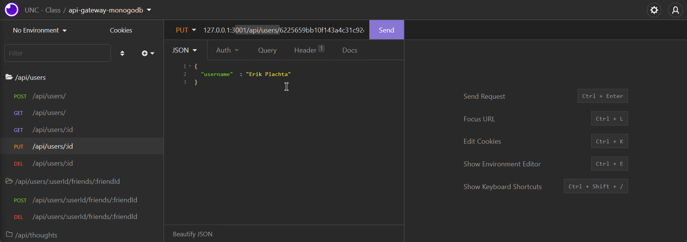

---

### `DELETE` - Remove a `User` from Database

Make a DELETE request with the `User._id` as a paramter, and if the `_id` is valid
the user will be deleted from the database.

- **Path**
  - `/api/users/:id`
- **Use**
  - DELETE `127.0.0.1:3001/api/users/<user-id-here>`
- **Example**
  > 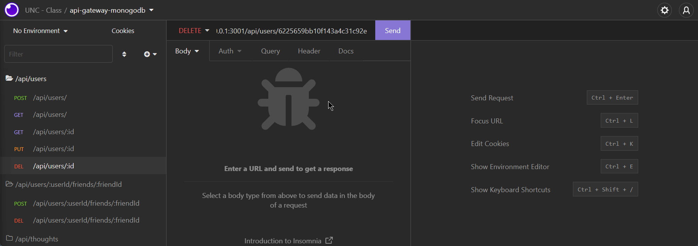

---

---

## Route: **`/api/users/:userId/friends/:friendId`**

### `POST` - Create One-Way Association To a `User` in `User.friends[]`

Make a `POST` request to add another `User._id` to a target `User.friends[]` via
a url parameter.
> [See here for more details on the User Schema](#userschema).

- **Path**
  - /api/users/:userId/friends/:friendId
- **Use**
  - `127.0.0.1:3001/api/users/<user-id-adding-friend>/friends/<user-id-of-friend-adding>`
- **Example**
  > 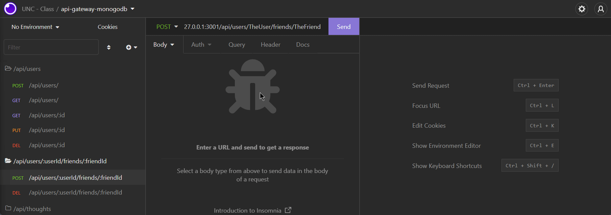

---

### `DELETE` - Remove Existing `friends` Association

Make a `DELETE` request to remove another `User._id` from a target `User.friends[]` via
a url parameter.
> [See here for more details on the User Schema](#userschema).

- **Path**
  - /api/users/:userId/friends/:friendId
- **Use**
  - `127.0.0.1:3001/api/users/<user-id-adding-friend>/friends/<user-id-of-friend-removing>`
- **Example**
  > 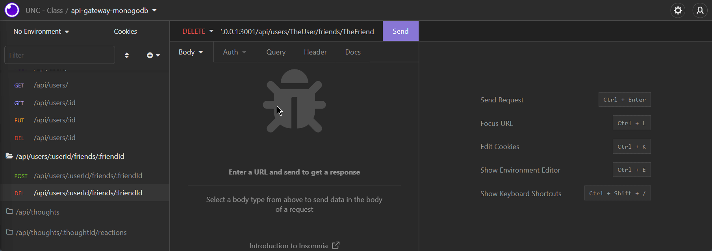

---

---

## Route: **`/api/thoughts/`**

### `POST` - Create a New `Thought` Entry

Make a POST request to create a new `Thought` with a JSON body that includes a
`username`, `userId`, and the content of the thought in `text`.
> [See here for more details on the thought Schema](#thoughtschema).

- **Path**
  - `/api/thoughts/`
- **Use**
  - POST  `127.0.0.1:3001/api/thought/`
  - JSON Body

    ```json
    {
      "thoughtText" : "<text-payload-of-thought>",
      "username"    : "<username-of-user-posting-thought>",
      "userId"      : "<user-posting-thought-id>"
    }
    ```

- **Example**
  > 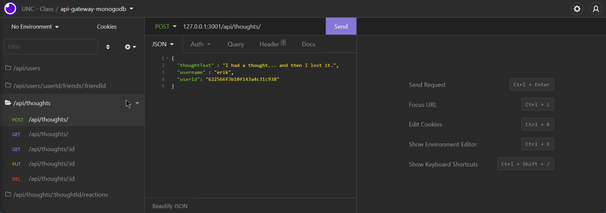

---

### `GET` - ALL `Thought` Entries

Make a GET request to receive ALL `Thought` entries within the database.
> [See here for more details on the Thought Schema](#thoughtschema).

- **Path**
  - `/api/thoughts/`
- **Use** 
  - GET `127.0.0.1:3001/api/thoughts`

- **Example**
  > 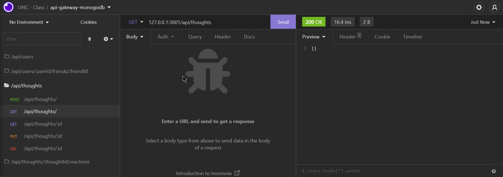

---

---

## Route: **`/api/thoughts/:id`**

### `GET` - Single `Thought` Entry by `_id`

Make a GET request to receive a specific `Thought` entry via a `thought`.`_id`
parameter.
> [See here for more details on the Thought Schema](#thoughtschema).

- **Path**
  - `/api/thoughts/:id`
- **Use**
  - GET `127.0.0.1:3001/api/thoughts/<thought-id>`
- **Example**
  > 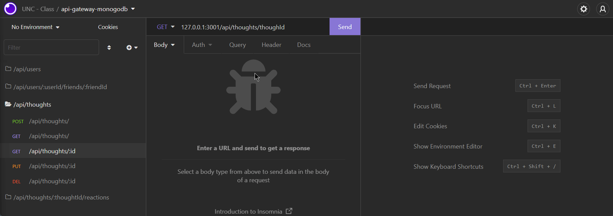

---

### `PUT` - Change `Thought` Value(s) by `_id`

Make a GET request to receive a specific `Thought` entry within the database by
sending a `thought`.`_id` parameter.
> [See here for more details on the Thought Schema](#thoughtschema).

- **Path**
  - `/api/thoughts/:id`
- **Use**
  - PUT `127.0.0.1:3001/api/thoughts/<thought-id>`
  - JSON Body

    ```json
    {
      "thoughtText" : "<thought-text-change>",
      "username"    : "<username-change>",
      "userId"      : "<userId-associated-to-username-change>"
    }
    ```

---

### `DELETE` - Remove a `Thought` Entry by `_id`

Make a `DELETE` request to receive with a specific `Thought`.`_id` paramater.
> [See here for more details on the Thought Schema](#thoughtschema).

- **Path**
  - `/api/thoughts/:id`
- **Use**
  - DELETE `127.0.0.1:3001/api/thoughts/<thought-id>`
- **Example**
  > 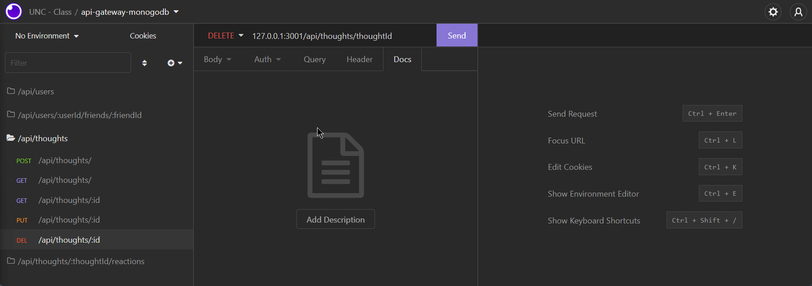

---

---

## Route: **`/api/thoughts/<thought-id-here>/reactions`**

### `POST` - Create a New `Reaction` Database Entry Associated to a `Thought`

Make a `POST` request to add a `Reaction` to a `Thought` by including the
existing `Thought`.`_id` as a pramater, and the reaction `BODY` as JSON.

- **Path**
  - `/api/thoughts/<thought-id-here>/reactions`
- **Use**
  - `127.0.0.1:3001/thoughts/<thought-id-here>/reactions`
  - JSON Body

    ```json
    {
      "reactionBody" : "<text-payload-of-reaction>",
      "username"    : "<username-of-user-posting-reaction>"
    }
    ```

- **Example**
  > 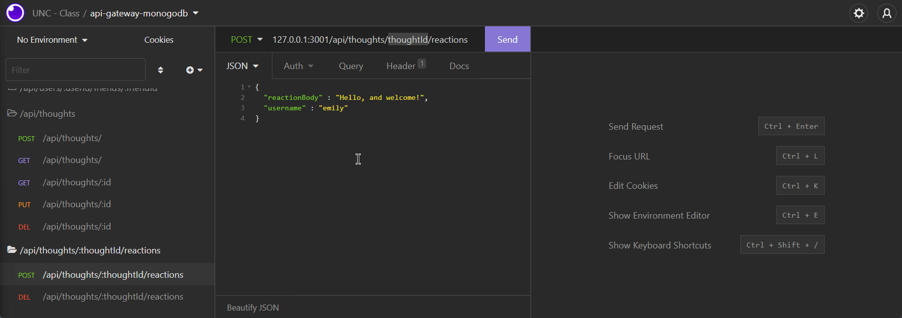

---

---

## Route: **`/api/thoughts/<thought-id-here>/reactions/<reaction-id-here>`**

### `DELETE` - Remove a `Reaction` Entry from a `Thought`

Make a `DELETE` request  to remove a `Reaction` from a `Thought` by including the
existing `Thought`.`_id` and `Reaction`.`_id` as pramaters.

- **Path**
  - `/api/thoughts/<thought-id-here>/reactions/<reaction-id-here>`
- **Use**
  - `127.0.0.1:3001/thoughts/<thought-id-here>/reactions/<reaction-id-here>`
- **Example**
  > 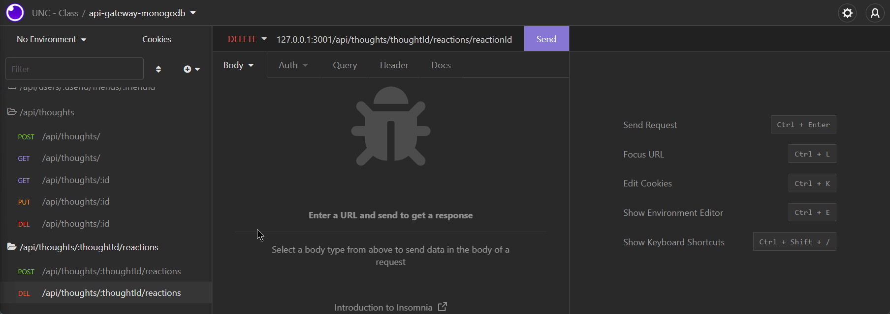

---

---

# Database Structure

## `UserSchema`

A `User` is an registered account within the database. They are provided a unique
`_id`, can have `friends`, post or delete a `thought`, and post or delete a `reaction`
to a thought too.

- **Schema**
  - `username`
    - String
    - Unique
    - Required
  - `email`
    - String
    - Unique
    - Required
    - valid email address
  - `password`
    - String
    - Required
    - 6 or more characters
  - `date_created`
    - Date
    - Auto generated on creation
  - `thoughts`
    - Array
    - Contains `Thought`.`_id` values  for each `Thought` created by `User`
  - `friends`
    - Array
    - Contains ObjectId values from other `User` Schema objects.
- **Virtuals**
  - `friendCount`
    - Int
    - Counts total number of `User._id` values in `User.friends[]` every-time User Schema Object is accessed

## `ThoughtSchema`

- **Schema**
  - `thoughtText`
    - String
    - Min-Max of 1-280 characters
    - Required
  - `username`
    - String
    - Required
    - References a `User` schema object's `username` field to associate thought to a `User`
  - `date_created`
    - Date
    - Auto generated on creation
  - `reactions`
    - Array
    - Contains `Reaction`.`_id` values for each unique reaction to `Thought`
- **Virtuals**
  - `reactionCount`
    - Int
    - Counts total number of `Reaction`.`_id` values in `Thought`.`reactions[]` every-time `Thought` Schema Object is accessed

## `ReactionSchema`

- **Schema**
  - `_id`
    - Schema.Type.objectId
    - Defaults new Type ObjectId
  - `username`
    - String
    - Required
  - `reactionbody`
    - String
    - Required
    - Min-Max of 1-280 characters
  - `date_created`
    - Date
    - Auto generated on creation

---
